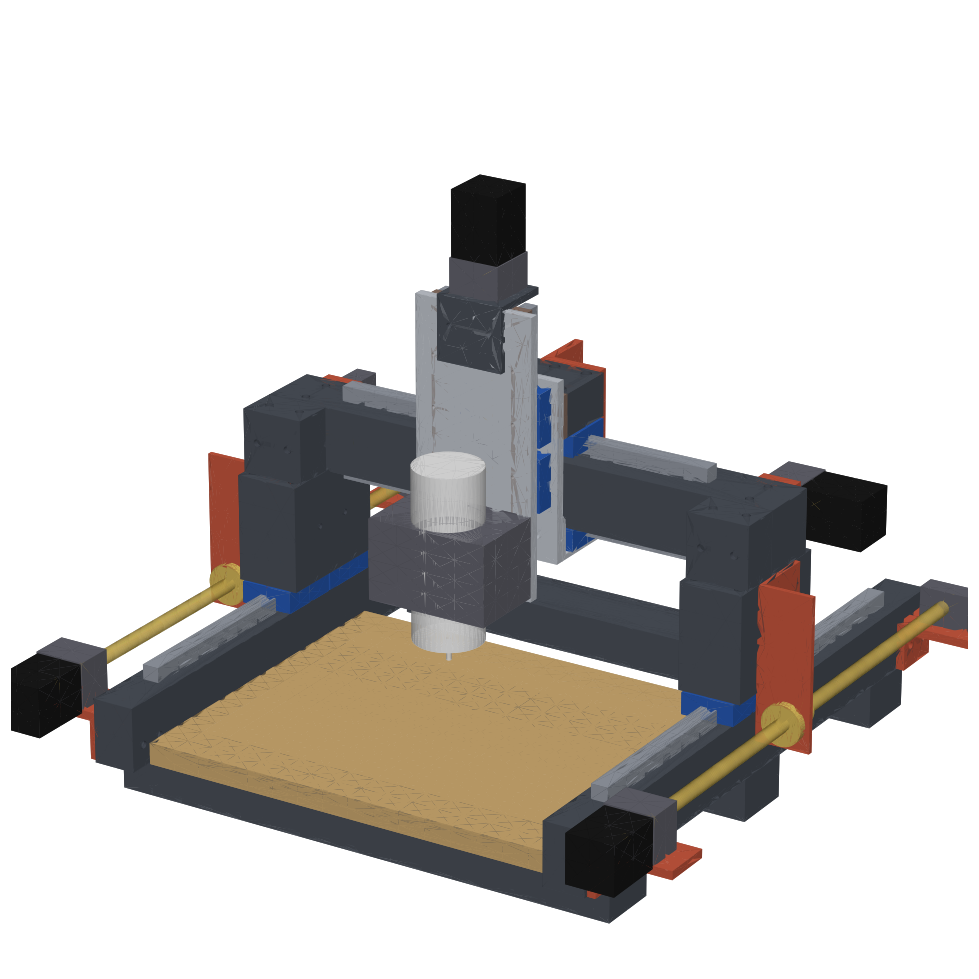

# 自作CNC フレーム (PrintNC V4 ベース / 3Dプリンター不要版)

[PrintNC](https://wiki.printnc.info/en/home) V4 の構成 (75x50x3 角パイプ + HGR20 レール + 1610 ボールねじ) をベースに、
**3Dプリント部品を使わず、角パイプ・平板・山形鋼の切断と穴あけだけで作れる**ように簡易化したフレームの
パラメトリック 3D モデル (Python / CadQuery) です。



## 元モデルについて

- PrintNC V4 の公式 Fusion 360 モデル (V4.0.30 Metalcutter / Woodcutter) は **Discord でのみ配布** されていて、
  この環境からはダウンロードできませんでした ([Files ページ](https://wiki.printnc.info/en/v4/files))。
- 代わりに、公開されている V4 の BOM 生成スクリプト
  [interias/PrintNC-BOM-Generator](https://github.com/interias/PrintNC-BOM-Generator) の部品定義
  (Y Frame / X Frame / Y Roller / Y Roller Brace / X Gantry / X Roller / 1Z Plate / 全ネジ締結 など) を参考に、
  構成を Python で組み直しています。**寸法は V4 公式モデルと一致しません。**
- 公式 `.f3d` を Discord から入手したら、STEP で書き出してこのリポジトリに置けば、寸法の照合と修正ができます。
- PrintNC は CC BY 4.0 です。

## 3Dプリント部品の置き換え

| V4 の部品 | この版での置き換え |
|---|---|
| ローラープレート (15mm 3Dプリント) | 12mm アルミ板 (V4 でも切削版として指定されている厚み) |
| ボールねじナットマウント (印刷/切削) | 山形鋼に Φ29 の穴を開けてナットを直接固定 |
| Z 軸まわりの印刷部品 | 12mm アルミ Z プレート、Z レール下のスペーサー (平鋼 20x10)、HM10-57 取付用の山形鋼 |
| BK/BF/HM の台座 | 平鋼スペーサー / 山形鋼 |
| 印刷ドリルガイド・組立治具 | 自動生成する **穴位置表 (CSV)** と **1:1 型紙 (SVG)**。組立時の直角は対角線を測って出す |
| フレーム接合 | 溶接なし。M8 ボルト + リベットナット、M6 皿ボルトで締結 |

## 公式 .f3d を STEP に変換する (Fusion スクリプト)

`.f3d` は Autodesk Fusion 専用の形式で、Fusion の外では読めない。
[`tools/F3dToStep`](tools/F3dToStep/F3dToStep.py) は Fusion の中で動かす Python スクリプトで、次のことを行う。

- 選んだ `.f3d` (複数可) を順に開いて `<名前>.step` を書き出す
- ユーザーパラメータの一覧を `<名前>_params.csv` に書き出す
- スクリプト先頭の `PARAM_OVERRIDES` に書いた値 (例: `XCuttingArea`) に変えてから書き出す。元の `.f3d` は変更しない

実行方法: Fusion → ユーティリティ → アドイン → スクリプトとアドイン → スクリプトの「+」で `tools/F3dToStep` フォルダを追加 → 実行。

### Fusion を使わない方法 (Autodesk のクラウド変換)

[`tools/f3d_to_step_aps.py`](tools/f3d_to_step_aps.py) は Autodesk Platform Services (APS) の Model Derivative API に
`.f3d` をアップロードして STEP を受け取る。APS のアカウントと Client ID / Secret が必要 (Fusion のインストールは不要)。

```bash
export APS_CLIENT_ID=... APS_CLIENT_SECRET=...
python tools/f3d_to_step_aps.py --list-formats        # f3d から変換できる形式を確認
python tools/f3d_to_step_aps.py PrintNC_V4.f3d         # -> PrintNC_V4.step
```

## 使い方

```bash
pip install -r requirements.txt
python build.py                                  # 既定: 加工範囲 300 x 400 x 150
python build.py --cut_z 100 --out output_z100       # 別の寸法で試す (output/ は上書きしない)
python build.py --pos_x 0 --pos_y 0 --pos_z 0    # 可動部を端に寄せた姿勢で出力 (干渉確認用)
python build.py --no-step --no-render            # 表と図面だけ素早く更新
```

パラメータはすべて [`printnc_simple/params.py`](printnc_simple/params.py) にあり、`--<名前> 値` で上書きできます。
加工範囲を変えると、レール長・ガントリー長・支柱高さ・Z ストローク・穴位置がまとめて再計算されます。

## 出力 (`output/`)

| ファイル | 内容 |
|---|---|
| `printnc_simple.step` | アセンブリ (部品ごとに色付き)。Fusion 360 / FreeCAD に読み込んで続きの設計に使う |
| `printnc_simple.stl` | 全体の STL (GitHub 上で 3D プレビューできる) |
| `summary.md` | 主要寸法、自動チェックの結果、切断リスト、購入品リスト |
| `cut_list.csv` | 切断リスト (Excel で開ける) |
| `drill_holes.csv` | 全加工品の穴位置 (面・端からの距離・穴径・用途) |
| `drawings/*.svg` | 面ごとの穴あけ図。380mm 以下の面は **1:1 型紙** (100% で印刷してポンチ打ち) |
| `preview.png` / `preview_iso.png` | 4 面図 / アイソメ図 |

座標系: X = ガントリー方向 (左右)、Y = 前後 (−Y が手前)、Z = 上。原点は床面上のフレーム中心。

## 加工範囲

**300 (X) × 400 (Y) × 150 (Z)** で確定。400 × 300 案 (ガントリー長 750mm) と比べて、ガントリーが 650mm と短く、
たわみは長さの 3 乗に比例するので約 2/3 になる。剛性を優先してこちらを採用した。

## 構成 (V4 パラメータ準拠)

[`reference/printnc_v4_user_parameters.csv`](reference/printnc_v4_user_parameters.csv) (V4 の Fusion ユーザーパラメータ) に合わせています。

- ベース: X フレーム 3 本 (75x50x3 を寝かせた足) の上に Y フレーム 2 本 (75x50x3 を立てる) を載せ、
  M8 ボルトとリベットナットで縦に締結。前後の X フレームは端から 50mm 内側
- Y 軸: HGR20 を Y フレーム上面に固定、1 本に HGW20CC ×2。Y ローラーは幅 75、長さ 150
- ガントリー: 75x75x4 を 1 本、Y ローラーに直接載せる (支柱なし)。ローラー中心から 25mm 後ろにずらし、
  前に空いた部分にガントリーブレース (75x50x6) を置いて留める
- X 軸: ガントリーの **上面と下面** に HGR20。上はトップローラー (75x50x3)、下はボトムローラー (アルミ山形 100x50x6)。
  両者の前面にシム 8mm を介してローラープレート (アルミ 12mm) を付ける
- Z 軸: 2Z 構成 (HGR15 ×2、HGH15CA ×4)。キャリッジをローラープレートに固定し、レール側 (Z プレート) が上下する
- スピンドルクランプの穴は 125 × 64 (V4 の標準 80mm クランプ)

### Z 150mm のための変更

V4 標準の Y ローラー高さ 50 では、捨て板からガントリー下までが約 94mm しかない。
PrintNC の FAQ にある「ローラーを背の高い角パイプにする」方法で対応し、`cut_z` から高さを自動で選ぶ。

| cut_z | Y ローラー | 捨て板からガントリー下まで |
|---|---|---|
| 60 | 75x50 (V4 標準) | 94 |
| 100 | 75x75 | 119 |
| 150 (既定) | 125x75 | 169 |

ローラーが高くなるほどガントリーも高くなり、剛性面では不利になる。

## 自動チェック

- `build.py` を実行するたびに、穴の縁からの距離と穴同士の間の肉厚が 3mm 以上あるかを確認する (座ぐりの径も含む)
- `python tools/check_clash.py` で、可動部を中央と両端に置いたときに部品同士が干渉しないかを確認できる

## 未確定・要確認

- **X / Y ボールねじの位置は V4 パラメータに情報がなく、仮置き** (図の赤茶色の部品)。
  Y はフレームの外側、X はガントリーの後ろに置いている。公式 STEP で確認して直す
- 上下 X レールの取付面 (上面と下面) はパラメータ名と wiki の記述からの推定
- 購入品 (HM12-57、BK/BF、ナットブロック) の穴位置は代表値。「現物合わせ」の穴は部品が届いてから寸法を測って決める
- ケーブルチェーン、リミットセンサー、配線は含めていない
- ガントリーのたわみなど、剛性の計算はしていない
